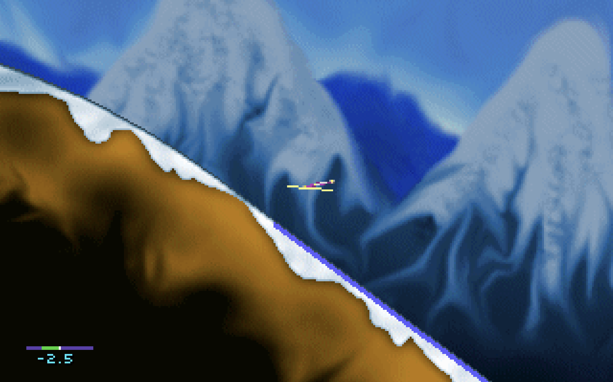

# Ski Jump International v3 (remake)

This repository will be a complete rewrite of the legendary DOS game Ski Jump International v3.

It's a work in progress, but already somewhat playable on web browsers: https://akheron.github.io/skijump3-remake



Also check out [the original game's website](https://www.nomasi.com/sj3/).

## Goals

The main goal of this project is to port the game to mobile web browsers.

Why does it need a complete rewrite? The original game is written in Pascal and is DOS-only.
An [SDL2 port exists](https://github.com/suomipelit/skijump3-sdl), but the combination of Pascal and SDL is not possible
to compile to web browsers.

## How?

The remake is written in Rust.

It's currently an "almost line-by-line" rewrite of the SDL2 port of the original Pascal code.
However, it's portable through a trait that abstracts platform specific details.

The available platforms are SDL2 and web (through WebAssembly).

One novel idea in the port is using Rust's async/await to allow unwinding of the deeply nested
game loop. This is required to return control to the top level after each frame when running in
web browsers.

Things still left to do:

- Not all Pascal code has been ported yet
- The game is not yet playable on mobile browsers. This would require a touch UI.
- There are low hanging fruits for performance improvements and to make the code more idiomatic Rust.

## Development

Desktop:

1. Install SDL development library
2. Run `cargo run --bin desktop`

Web:

```
cd web
./build.sh
python -m http.server -d dist
```
